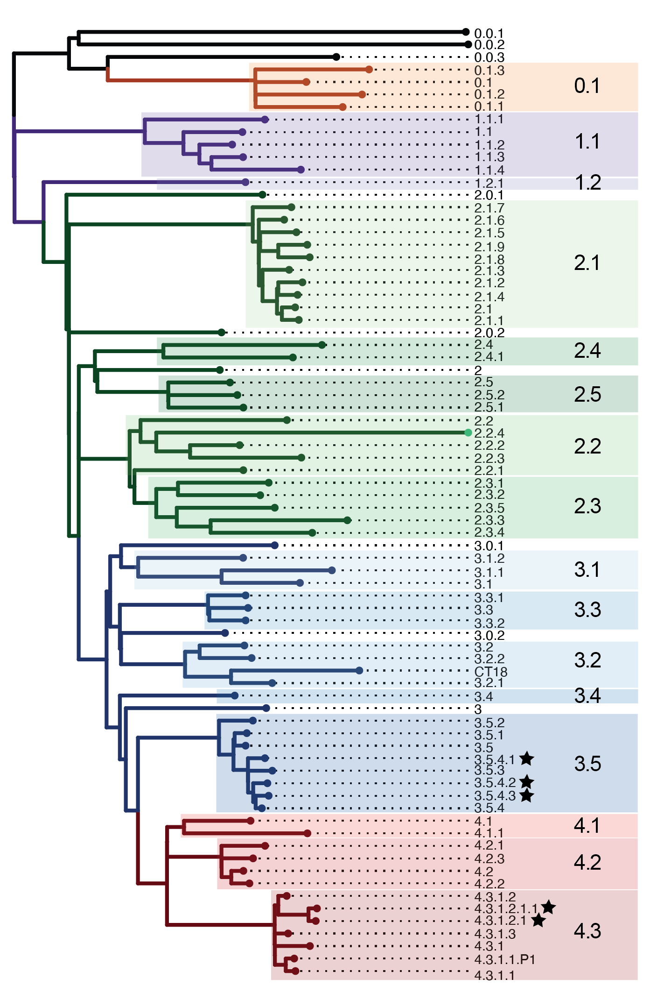

# Genotyping Salmonella Typhi

This repository houses the GenoTyphi genotyping scheme for Salmonella Typhi.

It also describes how to call genotypes, AMR and plasmid markers from Typhi whole-genome sequence reads using Mykrobe ('Typhi Mykrobe') and provides links to alternative tools for calling genotypes from reads or assemblies.

* [GenoTyphi scheme](#genotyphi-scheme)
* [Typing from reads using Mykrobe ('Typhi Mykrobe')](#typhi-mykrobe)
* [Other tools for callling genotypes from reads or assemblies](#other-typing-tools)


## GenoTyphi Scheme

The GenoTyphi genotyping scheme divides the *Salmonella* Typhi population into genotypes, which each represent a monophyletic cluster are defined by a unique single nucleotide variant (SNV) marker. There 4 major lineages, which are further divided into >75 different clades and subclades. The relationships between genotypes is conveyed in the name, so e.g. genotypes 2.2 and 2.3 are sister clades in the phylogeny, and 2.2 has daughter subclades 2.2.1, 2.2.2 and so forth, as illustrated in the figure below.



### Scheme specification

The latest scheme specification, mapping marker SNVs to genotypes, is detailed in the file `GenoTyphi_specification.csv` in this repository. This file also includes the standard clade-level colour codes that we use for consistency across papers.

### Scheme development

The initial development of the scheme is described in this paper, ["An extended genotyping framework for Salmonella enterica serovar Typhi, the cause of human typhoid", Wong et al, 2016, Nature Communications](http://www.nature.com/articles/ncomms12827/).

Subsequent updates to the genotyping scheme, including new genotypes and mutations conferring resistance to fluoroquinolones and azithromycin, are summarised in ["Five years of GenoTyphi: updates to the global Salmonella Typhi genotyping framework", Dyson & Holt, 2021, Journal of Infectious Diseases](https://doi.org/10.1093/infdis/jiab414) and this [technical report](https://doi.org/10.5281/zenodo.7407985).

The scheme is now managed by a working group of the [Global Typhoid Genomics Consortium](https://www.typhoidgenomics.org/), which is actively working to expand the scheme based on [new data](https://doi.org/10.7554/eLife.85867), and to establish rules for inclusion and naming of new genotypes. If you would like to suggest new genotypes please post an Issue in this repository, or to join the working group see the [consortium website](https://www.typhoidgenomics.org/).

### Citation

Whichever tool you use to access the GenoTyphi scheme, please cite the [2021 GenoTyphi paper](https://doi.org/10.1093/infdis/jiab414).

If you use the scripts in this repository, please also cite the repository: [](https://zenodo.org/badge/latestdoi/45819844)


## Typhi Mykrobe

* [Overview](#overview)
* [Quick start](#quick-start)
* [Detailed instructions](#detailed-instructions)
* [Output format](#explanation-of-columns-in-the-output)

### Overview
To call genotypes from reads, we recommend using 'Typhi Mykrobe'.

The [Mykrobe](https://github.com/Mykrobe-tools/mykrobe) software provides a platform for kmer-based genotyping direct from fastq files. It was originally developed for genotyping TB and _Staph. aureus_ genomes, but we have developed a Mykrobe panel of genotyping probes for Typhi which provides simultaneous typing of:
* GenoTyphi genotype calls
* acquired antimicrobial resistance (AMR) genes
* mutations in the quinolone-resistance determining region (QRDR) of genes *gyrA*, *gyrB* and *parC*
* the *acrB*-R717Q/L mutations associated with azithromycin resistance
* plasmid replicons and major subtypes of the IncHI1 plasmid typically associated with multidrug resistance 

Drugs for which resistance is typed are: `ampicillin`, `azithromycin`, `ceftriaxone`, `ciprofloxacin`, `chloramphenicol`, `sulfonamides`, `trimethoprim`, `trimethoprim-sulfamethoxazole`, `tetracycline`. The output is presented as an antibiogram, indicating resistant (R) or susceptible (S) predictions for each drug in each genome.

A full list of AMR/plasmid typing targets is in the file `typhimykrobe/AMR_genes_mutations_plasmids.csv`

Below you will find instructions for installing and running Mykrobe with the Typhi panel, as well as a Python script for tabulating the results from multiple readsets (input = fastq, single or paired per genome; output = JSON, 1 per genome) into a simple tab-delimited table (input = JSON files, 1 per genome; output = single TSV).


### Quick start

#### Install Mykrobe:

From bioconda:
```
conda install -c bioconda mykrobe
```
From source (after downloading mykrobe, from the mykrobe directory):
```
pip3 install . && mykrobe panels update_metadata && mykrobe panels update_species all
```

#### Run Mykrobe on fastq file/s for a given genome:

```
mykrobe predict --sample aSample \
  --species typhi \
  --format json \
  --out aSample.json \
  --seq aSample_1.fastq.gz aSample_2.fastq.gz
```

Output is one JSON file per genome

If your input fastq are Oxford Nanopore Technologies (ONT) reads, add the `--ont` flag to the command.

#### Tabulate Mykrobe results for one or more genomes:

(requires Python3 + pandas library)

(python script `parse_typhi_mykrobe.py` is in this repository in the `/typhimykrobe` directory in this repository)

```
python parse_typhi_mykrobe.py --jsons *.json --prefix mykrobe_out
```

Output is a single tab-delimited table, output format is [described below](#explanation-of-columns-in-the-output).

### Detailed instructions
* [Install Mykrobe and Typhi panels](#installing-mykrobe)
* [Run Mykrobe](#running-mykrobe)
* [Tabulate Mykrobe output](#parse-mykrobe-output)
* [Output format](#explanation-of-columns-in-the-output)

### Installing mykrobe

First, install Mykrobe (v0.10.0+) as per the instructions on the [Mykrobe github](https://github.com/Mykrobe-tools/mykrobe).

Once Mykrobe is installed, you can run the following two commands to ensure you have the most up-to-date panels for genotyping, including the [Typhi panel](https://doi.org/10.6084/m9.figshare.21695528.v1):
```
mykrobe panels update_metadata
mykrobe panels update_species all
```

You can check what version of the scheme is currently loaded in your Mykrobe installation via:
```
mykrobe panels describe
```

### Running Mykrobe

Inputs are fastq files.

Mykrobe can be run on each individual sample using the command below. Replace `aSample` with the name of your isolate. The command below uses Illumina data.

```
mykrobe predict --sample aSample --species typhi --format json --out aSample.json --seq aSample_1.fastq.gz aSample_2.fastq.gz
```

To run on ONT data instead, add the `--ont` flag to your command.

Further details on options can be found on the Mykrobe wiki: https://github.com/Mykrobe-tools/mykrobe/wiki

### Parse Mykrobe output

#### Code

`typhimykrobe/parse_typhi_mykrobe.py`

We have provided a custom python3 script, `parse_typhi_mykrobe.py`, that will take a group of JSON files output by Mykrobe and summarise these into a single, tab-delimited table.

The parser script will only report details of calls for genomes that are identified by Mykrobe as Typhi. Currently, a sample must have >=85% identity to Typhi MLST locus sequences to be called by the parser. This threshold may not be low enough to correctly parse JSON files created by analysing ONT data (however all the Mykrobe calls will still be present in the JSON file).

Note that due to the nested hierarchical nature of the GenoTyphi scheme, we needed to create fake levels within the scheme to facilitate correct calling by Mykrobe. These fake levels are not reported in the output generated by the parser, but they are present in the raw JSON files output by Mykrobe. These can be identified in the JSON output as they are prepended by the word "lineage", and will always have a call of 0 from Mykrobe.

#### Dependencies

* Python 3 
* library `pandas`

#### Input

* JSON files output by Mykrobe
* prefix for output file

#### Output

* TSV file, one row per input JSON file

#### Example command
```
python parse_typhi_mykrobe.py --jsons *.json --prefix mykrobe_out
```

### Explanation of columns in the output:
* **genome**: sample ID
* **serovar**: species call from Mykrobe (Typhi or unknown; determined by matching to Typhi STs from the 7-locus MLST scheme)
* **spp_percent:** percentage coverage to the Typhi ST probes
* **final genotype**: final genotype call from Mykrobe, using the latest version of GenoTyphi
* **confidence**: measure of confidence in the final genotype call, summarising read support across all levels in the hierarchy (lineage, clade, subclade, etc)
  * _strong_ - high quality calls (quality of '1' reported by Mykrobe) for ALL levels;
  * _moderate_ - reduced confidence for ONE node (Mykrobe quality of '0.5', but still with >50% read support for the marker allele), high quality calls for ALL OTHERS;
  * _weak_ - low quality for one or more nodes (Mykrobe quality of '0.5' and <50% read support OR Mykrobe quality of '0').
* **lowest support for genotype marker**: For any markers in the final genotype call that do not have a Mykrobe quality of '1', this column reports the percentage of reads supporting the marker allele at the most poorly supported marker (details of all such markers appear in the 'poorly supported markers column').
* **poorly supported markers**: Lists any markers in the final genotype call that do not have Mykrobe quality of '1'. Markers are separated by ';', values in brackets represent the quality call from Mykrobe, followed by the read depth at the alternate / reference alleles. The lowest read support amongst these markers is reported in the previous column.
* **max support for additional markers**: For any markers detected that are incongruent with the final genotype call, this column reports the percentage of reads supporting the marker allele at the best supported additional marker.
* **additional markers**: Lists any markers that are incongruent with the final genotype call. Markers are separated by ';', and the format is identical to column _poorly supported markers_. The highest read support for any such marker is reported in the previous column.
* **node support**: A list of all markers in the final genotype call with their Mykrobe quality calls (1, 0.5, or 0) and the read depths at the marker allele / reference allele (as per _poorly supported markers_ and _additional markers_).
* **resistance predictions**: Columns `ampicillin`, `azithromycin`, `ceftriaxone`, `ciprofloxacin`, `chloramphenicol`, `sulfonamides`, `trimethoprim`, `trimethoprim-sulfamethoxazole`, `tetracycline` indicate resistant (R) or susceptible (S) predictions for each genome. For `ciprofloxacin`, low-level resistance (associated with a single mutation or gene) is indicated as intermediate (I) and high-level resistance (multiple determinants) as R. A resistant (I/R) prediction is appended with the genes or mutations giving rise to that prediction.
* **remaining columns** indicate presence (1) or absence (0) of each QRDR or _acrB_ mutation, AMR gene, or plasmid replicon as indicated by the header of the column. For the AMR genes, _specific alleles are **not detected**_ (with the exception of _dfrA_ and blaOXA, where Mykrobe can distinguish between _dfrA1_, _dfrA5_, _dfrA7_, _dfrA14_, _dfrA15_, _dfrA17_ and _dfrA18_; and blaOXA-7 and blaOXA-134).
  * **num QRDR**: Total number of mutations detected in the quinolone-resistance determining regions (QRDR) of genes _gyrA_, _parC_ and _gyrB_.
  * **IncHI1_ST6** indicates whether the IncHI1 replicon (from column IncHI1BR27) is pST6 (1) or not (0).
 
Sequences and details of probes are available [here](https://doi.org/10.26180/14881701.v1).


## Other typing tools

Other tools that can be used to assign GenoTyphi lineages to Typhi genomes

* [Pathogenwatch](https://pathogen.watch/) is an online platfomr, users can upload Typhi genome assemblies and get GenoTyphi lineages, AMR and plasmid determinants, as well as cluster-based phylogenetic trees, as described in [this paper](https://www.nature.com/articles/s41467-021-23091-2). It can also be used to identify public Typhi genomes of a given genotype (and/or from a specific country of interest).

* [Original Python implementation](mappingbased/README.md#original-implementation-pre-mapped-data). This takes as input **BAM or VCF files that the user has already generated** by aligning Illumina reads or assemblies to the reference genome CT18. It also detects the QRDR and *acrB* mutations listed in `typhimykrobe/AMR_genes_mutations_plasmids.csv` in this repository, but it does not call acquired genes or plasmid markers.

* The [BioHansel](https://github.com/phac-nml/biohansel) tool implements calling of GenoTyphi lineages along with those for other pathogens, as described in [this paper](https://doi.org/10.1099/mgen.0.000651). 

